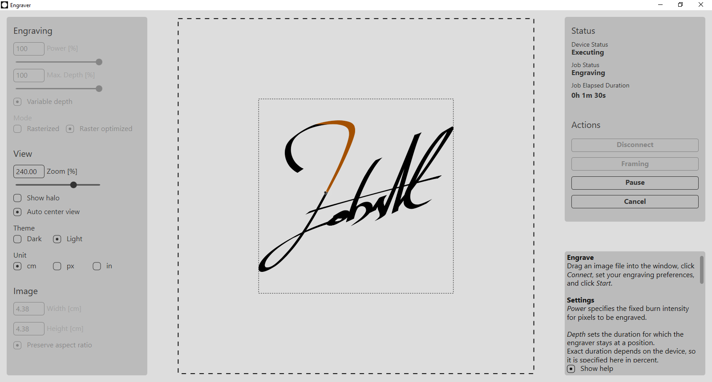

# Laser Engraver
This project serves as an alternative to the software that comes with K3/K5 laser engravers.  

## Motivation
The original software the device comes with supports only rasterized engraving, which can unnecessarily prolong the engraving duration for simple shapes.  
This project aims to optimize the engraving process by analyzing the input image and determining the most efficient path for the laser, potentially reducing the process time.  

## Limitations
The K3/K5 engraver is primarily designed for rasterized engraving, i.e., it only has instructions for horizontal engraving.  
It also includes commands for specific location movement, homing, fan control, and other technical instructions.  
Due to the high latency in acknowledging received commands, the engraver performs optimally when multiple horizontal pixels in succession are engraved with a single command.  
Right-to-left engraving works well only when preceded by a left-to-right instruction.  
The **Raster Optimized** mode considers these factors and seeks to find the best path that optimizes horizontal left-to-right engraving while minimizing unnecessary movements.  

## Installation
To install, either clone the repository or download the source code and compile the application using Visual Studio.  
Currently, only a Windows build profile is available as I don't use Linux with a GUI. Future releases will include prebuilt executables.

## How to use

### Engrave
Drag an image file into the window, click *Connect*, set your engraving preferences, and click *Start*.  



The highlighted area represents the portion that has already been engraved, while the dot indicates the current position of the laser.  

### Settings
- **Depth** determines how long the engraver stays at a position. The exact duration depends on the device and is specified here in percent.  
- **Variable depth**: If enabled, this setting determines the burn duration/depth per pixel based on pixel brightness (including alpha channel).  
Use this setting only when grayscale engraving is required as each pixel would likely require a separate instructions, increasing total engraving time due to high instruction acknowledgment latencies.
- **Max. Depth**: When **Variable depth** is enabled, this option limits the burn duration/depth to a maximum value.
- **Power**: Specifies fixed burn intensity for pixels to be engraved.
- **Threshold**: Determines at what percent brightness a pixel is engraved when *Variable burn intensity* is disabled.
- **Rasterized**: Engraves pixels in rows in a grid pattern.  
This setting yields quickest results for images with minimal empty spaces in between.  
- **Raster optimized**: Optimizes for better horizontal line performance by finding an efficient path.  
Use this setting for simple shapes or images with large empty spaces.
- **Show halo**: A visual setting that does not affect engraving.

### Keyboard Shortcuts
- `Ctrl` + `Left mouse button`: Moves the view (resets *Auto center view* setting).
- `Ctrl` + `Mouse wheel` and `Ctrl` + `+`/`-`: Adjusts zoom level.
- `Ctrl` + `0`: Resets zoom level.

## Configuration
All settings are stored in `appsettings.json`. If this file does not exist, it will be created at startup with default settings.  
While most settings can be configured via the UI, some (like custom themes and device settings) must be directly configured in the file.  
This section details settings that can only be set in `appsettings.json`.

### Example
```json
{
  "DeviceConfiguration": {
    "DPI": 510.54,
    "WidthDots": 1608,
    "HeightDots": 1608,
    "Type": 2,
    "PortName": "COM5"
  },
  "UserConfiguration": {
    "Culture": "en",
    "ShowHelp": false,
    "AutoCenterView": true,
    "PreserveAspectRatio": true,
    "Unit": 1,
    "Theme": {
      "CanvasBackground": "#FFDDDDDD",
      "Foreground": "#FF111111",
      "SectionBackground": "#FFBBBBBB",
      "ErrorMessageForeground": "#FF750010",
      "BurnTargetBackground": "#FFFFFFFF",
      "BurnVisitedColor": "#FFA35000",
      "BurnStartColor": "#00000000",
      "BurnEndColor": "#FF000000"
    },
    "CustomTheme": null
  },
  "BurnConfiguration": {
    "Power": 255,
    "Duration": 255,
    "FixedIntensityThreshold": 127,
    "PlottingMode": 1,
    "IntensityMode": 1
  }
}
```

### DeviceConfiguration
This section should not be modified, as it is preconfigured for K3/K5 laser engravers.  
Other models are not supported as of now.  

- **DPI**: Dots per inch
- **WidthDots**/**HeightDots**: Width and height of the canvas. This value should only be decreased, when the device is evidently trying to move out of bounds.  
- **Type**: Set to 1 for demo-mode (default in debug-builds), which simulates a mockup device. Select 2 for USB devices (default in release-builds). Other devices are not supported.
- **PortName**: Name of the serial port. Should only be modified/specified when asked by the application. Might happen, when more than one serial device is connnected.  
- **BaudRate**: Baud rate of the connection

### UserConfiguration
- **Culture**: The application is fully localized in both German (`de`) and English (`en`).
- **Theme**: This setting is overwritten when a theme (dark/light) is selected. If you wish to customize these settings, change `Theme` to `CustomTheme`. Otherwise, these settings will be overwritten.

### BurnConfiguration
This section specifies how the engraving should be performed.  
All of these settings can be configured using the UI.  

## Demo Mode
If you don't have a K3/K5 laser engraver or if you just want to try out this tool,  
set the `Type` setting in the `DeviceConfiguration` section in `appsettings.json` to 1.  
This will put the application in demo mode, simulating a mockup device.
